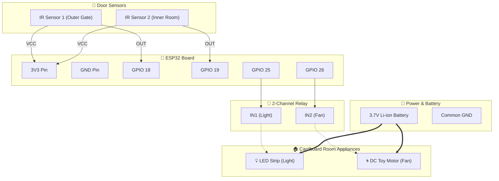

# 📦 Cardboard Mini Project: Wiring & Connection Guide


---

## 📐 Cardboard Door Setup (Sensors Position)
Cardboard veetoda door / entrance-la 2 IR sensors-ah sequential-ah vekkanum:

```
          [ CARDBOARD ROOM ENTRANCE ]
------------------------------------------------
(Outer Gate)                                (Inner Room)
      |                                           |
   [ IR 1 ]   <--- 8cm to 12cm Gap --->       [ IR 2 ]
      |                                           |
------------------------------------------------
Direction 1: Aalu ulla vandha   -> IR1 cut aagum, then IR2 cut aagum (COUNT + 1)
Direction 2: Aalu veliya pona   -> IR2 cut aagum, then IR1 cut aagum (COUNT - 1)
```

---

## ⚡ Power Supply & Motor Driver Alert (Romba Mukkiyam)
1. **Direct-ah ESP32 pin-la Motor / LED strip connect panna koodadhu:**
   * ESP32 GPIO pin-la maximum 12mA dhaan varum. DC Toy motor 100mA-ku mela edukum. Direct-ah connect panna ESP32 pin burn aagidum!
   * Adhanala **Relay Module** (illana **BC547 / 2N2222 Transistor**) use pannanum.
2. **3.7V Battery Connection:**
   * Unga kitta irukura 3.7V Li-ion battery-ah direct-ah Relay & Motor & LED-ku power supply-ah use pannikalam.
   * ESP32-ku: USB cable vazhiya oru Power Bank / 5V Phone charger podalam (Best & safe demo for college viva), **OR** 3.7V battery-ah oru chinna **Boost Converter (MT3608 or TP4056 with booster)** moolama 5V aaki ESP32 `VIN` pin-la kudukalaam.
   * **GND must be COMMON:** Battery GND-yum ESP32 GND-yum kandippa onna connect pannanum!

---

## 🔌 Complete Pin-to-Pin Connections

### 1. IR Sensor 1 (Outer Gate):
* `VCC` -> ESP32 **3V3**
* `GND` -> ESP32 **GND**
* `OUT` -> ESP32 **GPIO 18**

### 2. IR Sensor 2 (Inner Room):
* `VCC` -> ESP32 **3V3**
* `GND` -> ESP32 **GND**
* `OUT` -> ESP32 **GPIO 19**

### 3. Relay Module (Recommended Easiest Way):
* `VCC` -> ESP32 **VIN** (5V power)
* `GND` -> ESP32 **GND**
* `IN1` (Light) -> ESP32 **GPIO 25**
* `IN2` (Fan)   -> ESP32 **GPIO 26**

#### Relay Output to DC Motor & LED Strip:
* **Relay 1 (Light):**
  * `COM` -> Battery Positive (+)
  * `NO`  -> LED Strip Positive (+)
  * LED Strip Negative (-) -> Battery Negative (-)
* **Relay 2 (Fan - DC Toy Motor):**
  * `COM` -> Battery Positive (+)
  * `NO`  -> DC Toy Motor Wire 1
  * DC Motor Wire 2 -> Battery Negative (-)

---

## 📊 Circuit Diagram (Mermaid)


